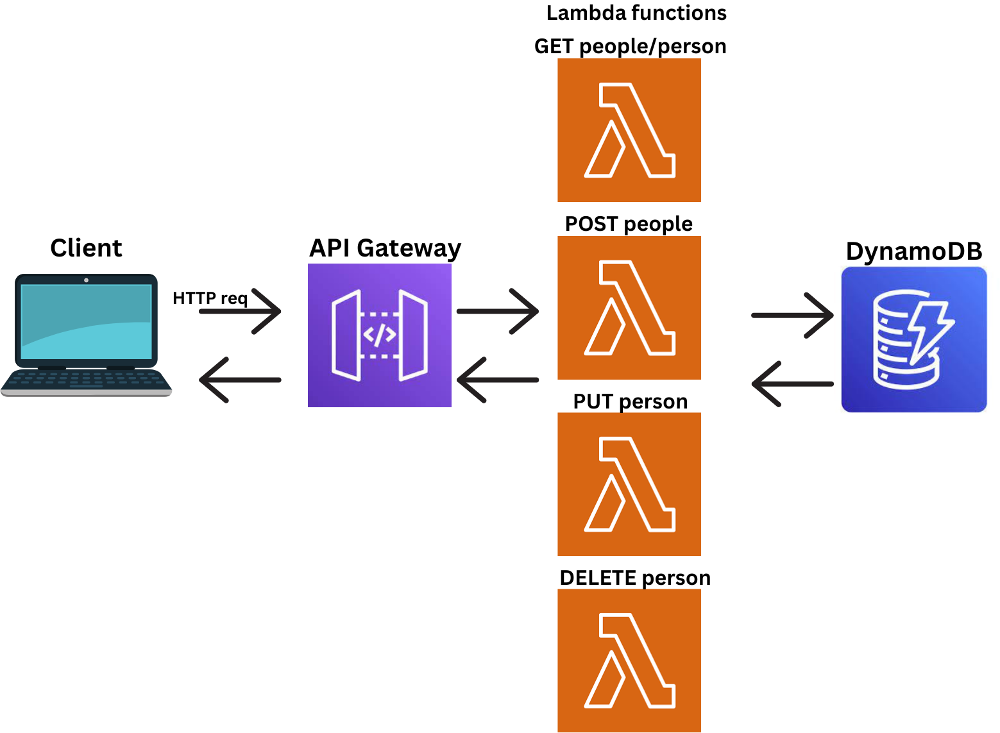
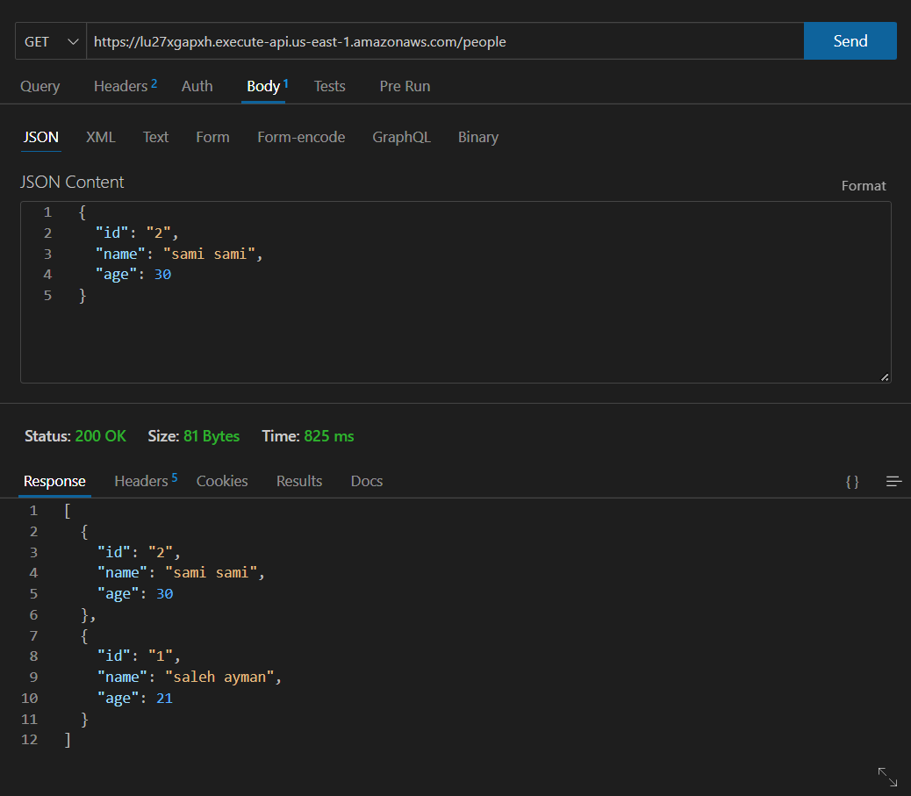
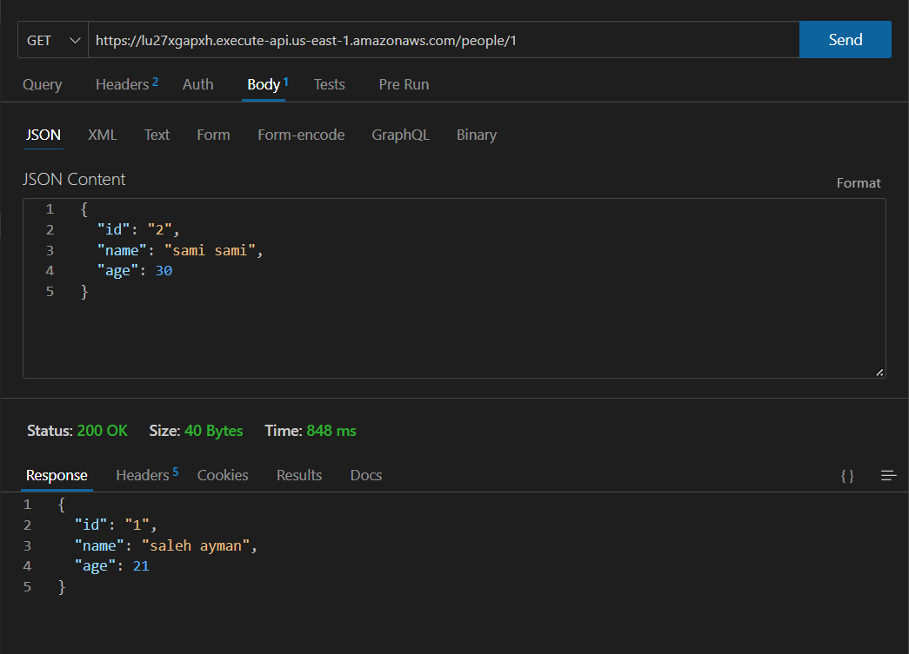
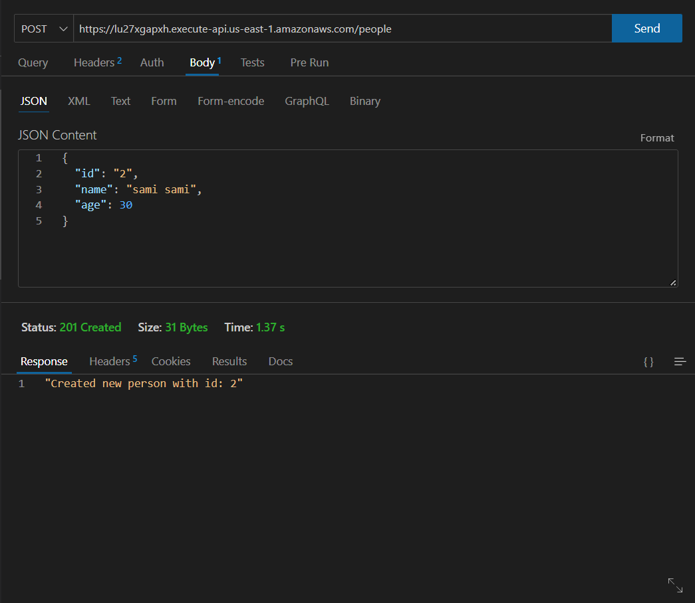
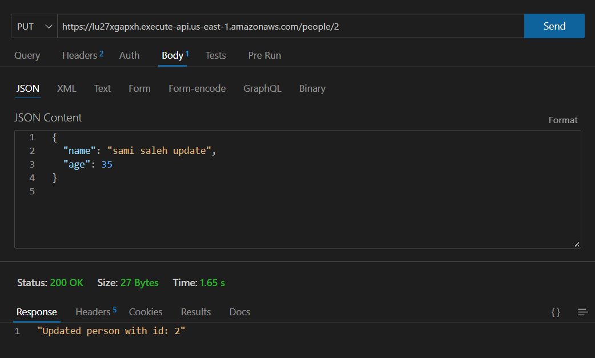
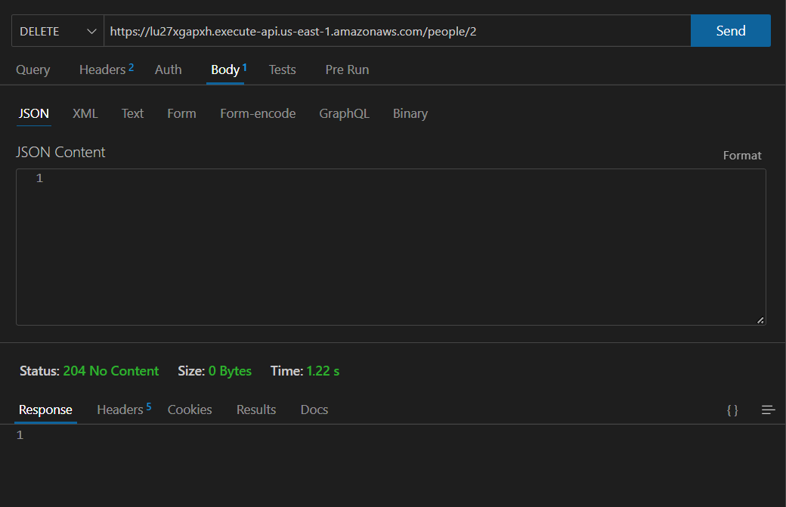

# serverless-api

##### UML :

Root URL for the API : [Here](https://lu27xgapxh.execute-api.us-east-1.amazonaws.com/people)

Routes :

- GET /people. to get all the people.
- GET /people/{id}. to get the data for one personr beased on the ID.
- POST /people. creating a new person.
- PUT /people/{id}. updating an existing person by ID.
- DELETE /people/{id}. deleting a person from the people list based on the id

To test each rout for them you can use postman, thunder clint, CURL, etc...

- For the GET /people route:

- For the GET /people/{id} route:

- For the POST /people route:

- For the PUT /people/{id} route:

- For the DELETE /people/{id} route:
